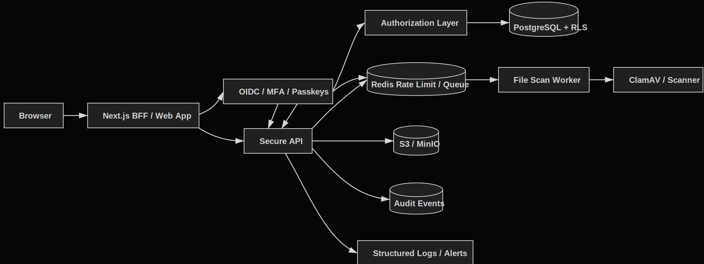

# TrustVault Lite

TrustVault Lite is a B2B multi-tenant SaaS portfolio demo built as a secure client evidence portal for confidential documents, compliance evidence, contracts, and reports.

The goal is to demonstrate real security controls in a small product. This project does not claim certification or formal compliance.

## Positioning

**ASVS-inspired secure SaaS demo, focused on tenant isolation, authorization, secure file handling, auditability, and secure SDLC.**

TrustVault Lite is inspired by:

- OWASP ASVS for secure verification requirements.
- OWASP API Security Top 10 for risks such as BOLA and BOPLA.
- OWASP File Upload Cheat Sheet for secure upload handling.
- NIST Digital Identity Guidelines for digital identity principles.
- OWASP SAMM for a simplified secure SDLC.

## Target Features

- Multi-tenant organizations with `tenant_id` on business data.
- Centralized RBAC and ABAC policy layer.
- PostgreSQL Row Level Security as defense in depth.
- Secure file uploads with validation, scanning, and private storage.
- Short-lived signed download URLs.
- Hashed API keys with scopes, expiry, and revocation.
- Audit logs and security dashboard.
- Secure sessions and MFA/passkeys through an identity provider.
- CI/CD with linting, tests, dependency scanning, secret scanning, SAST, container scanning, and ZAP baseline.

## Documentation

- [Product brief](docs/product/product-brief.md)
- [Demo script](docs/product/demo-script.md)
- [Implementation plan](docs/implementation/implementation-plan.md)
- [Backlog](docs/implementation/backlog.md)
- [Definition of done](docs/implementation/definition-of-done.md)
- [Security overview](docs/security/README.md)
- [Threat model](docs/security/threat-model.md)
- [Architecture](docs/security/architecture.md)
- [ASVS mapping](docs/security/asvs-mapping.md)
- [Risk register](docs/security/risk-register.md)
- [Security test plan](docs/security/security-test-plan.md)
- [Incident response](docs/security/incident-response.md)
- [Secure SDLC](docs/security/secure-sdlc.md)

## Architecture Diagram



## Proposed Repository Structure

```text
trustvault-lite/
  apps/
    web/
    api/
    worker/
  packages/
    authz/
    validation/
    audit/
    config/
  infra/
    docker/
    migrations/
  docs/
    product/
    implementation/
    security/
  .github/
    workflows/
```

## MVP Phases

1. SaaS foundation: auth, tenants, memberships, invitations.
2. Document vault: projects, upload, scan status, secure download.
3. Authorization hardening: policy layer, negative tests, field-level filtering.
4. Security dashboard: audit logs, API keys, sessions, MFA status, share links.
5. DevSecOps: security pipeline and verifiable reports.

## Local Development

```bash
pnpm install
pnpm db:up
pnpm db:migrate
pnpm dev:api
pnpm dev:web
```

The local PostgreSQL service is defined in `infra/docker/docker-compose.yml`.
The initial RLS migration is in `infra/migrations/0001_initial_rls.sql`.

Database-backed integration tests are opt-in:

```bash
pnpm db:up
pnpm db:migrate
pnpm test:db
```

## Security Controls Matrix

| Area | Control | Implemented Through | Testable Through |
| --- | --- | --- | --- |
| Auth | MFA / passkeys | Identity provider | Login flow |
| Sessions | Secure cookies | BFF/session config | Header tests |
| Authorization | RBAC + ABAC | `can()` policy layer | Role tests |
| Tenant isolation | RLS + `tenant_id` | PostgreSQL policies | Cross-tenant tests |
| API Security | Scoped API keys | Hash + scopes + expiry | API integration tests |
| File Security | Validation + scanning | Upload worker | Upload tests |
| Data Protection | Private storage | Signed URLs | Download tests |
| Auditability | Audit events | Audit service | Audit assertions |
| Browser Security | CSP + headers | Middleware | Header tests |
| DevSecOps | Security scans in CI | GitHub Actions | Pipeline artifacts |
| Secrets | No secrets in repo | Secret scanning | CI secret scan |
| Incident Response | Playbooks | Docs | Manual review |

## Assumed Limitations

- This is a portfolio demo, not a certified product.
- Malware scanning may start with a documented mock and later move to ClamAV.
- Billing is mocked.
- The identity provider may run locally for demo purposes, but the integration should follow OIDC Authorization Code Flow.
