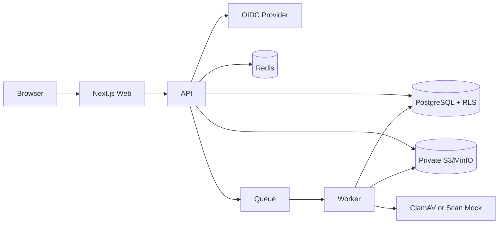
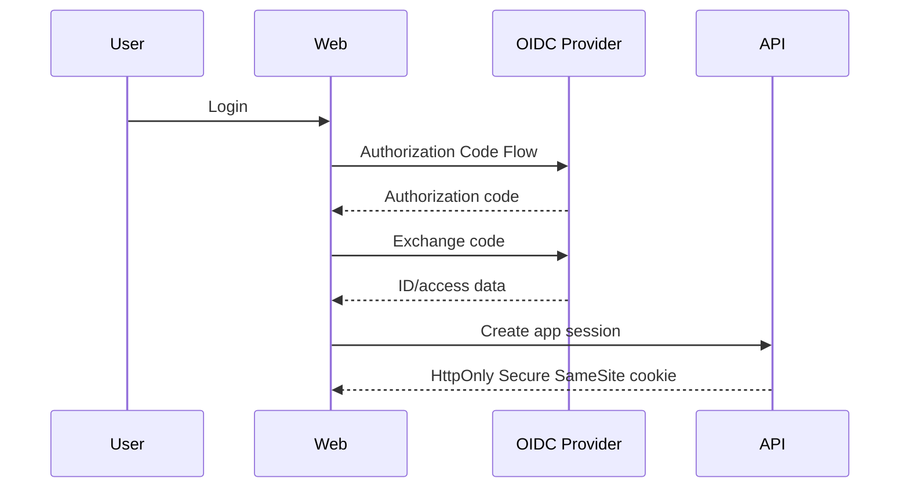
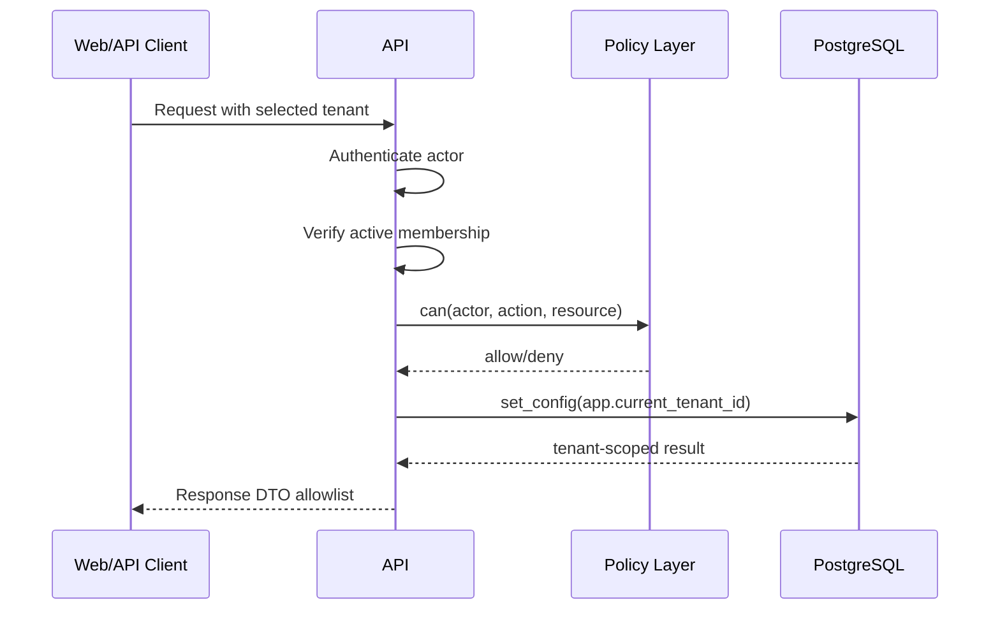
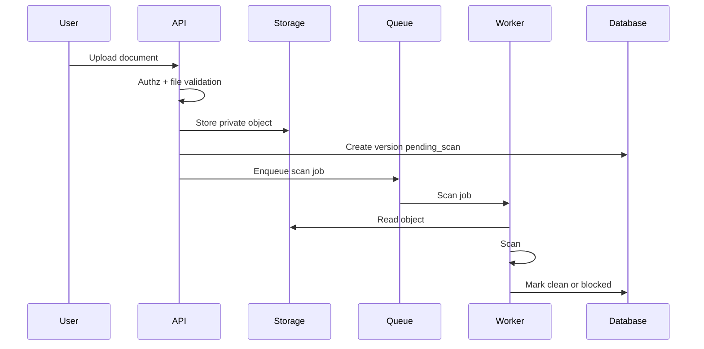

# Architecture

## Context

TrustVault Lite este un SaaS B2B multi-tenant format din frontend, API, worker, PostgreSQL, Redis, object storage si identity provider.

## Component Diagram

## Auth Flow

## Tenant Request Flow

## Upload Flow

## Download Flow

1. Actor cere download.
2. API autentifica actorul.
3. API verifica tenant, rol, proiect si scan status.
4. API refuza fisierele care nu sunt `clean`.
5. API creeaza signed URL scurt si expirabil.
6. API logheaza audit event.

## Data Model

Tabele principale:

- `users`
- `tenants`
- `memberships`
- `projects`
- `documents`
- `document_versions`
- `share_links`
- `api_keys`
- `audit_events`
- `support_access_requests`

## Browser Hardening

Header-ele minime:

- `Content-Security-Policy`
- `Strict-Transport-Security`
- `X-Content-Type-Options: nosniff`
- `X-Frame-Options: DENY`
- `Referrer-Policy: strict-origin-when-cross-origin`
- `Permissions-Policy`

